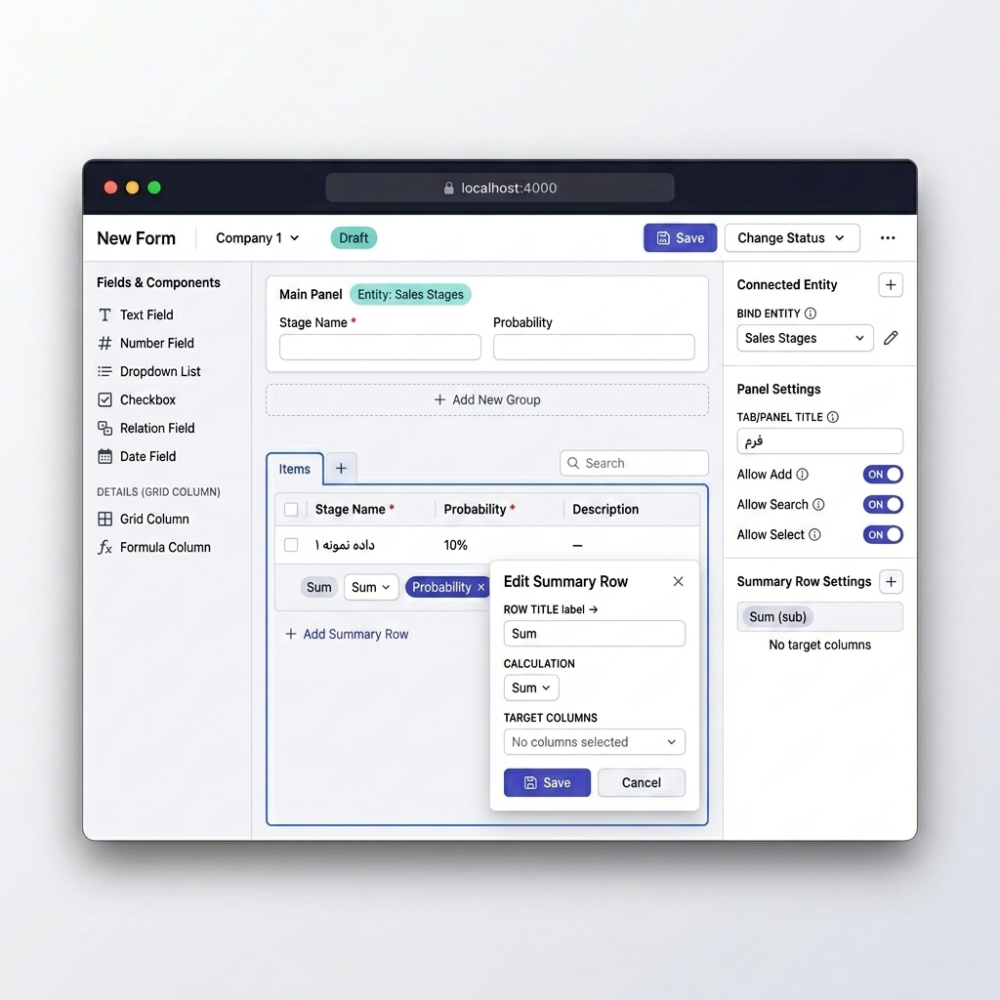
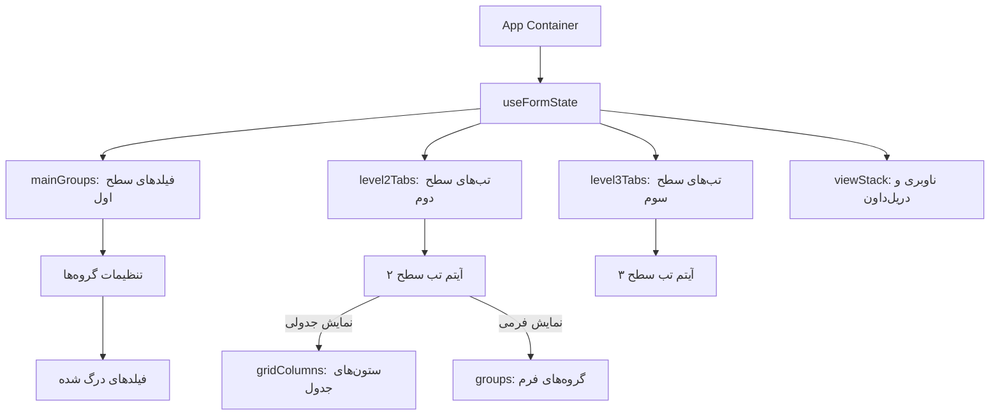

# سازنده فرم‌های ERP — طراح ماژولار و پرمیوم درگ‌-اند-دراپ با پشتیبانی پیش‌فرض از راست‌چین (RTL)

[](README.md)
[](README.fa.md)

یک سیستم طراح فرم پیشرفته و پیش‌رو که به صورت تخصصی برای محیط‌های پیچیده سازمانی و سیستم‌های برنامه‌ریزی منابع سازمانی (ERP) توسعه یافته است. این پروژه با پشتیبانی بومی از چیدمان راست‌چین (RTL)، تایپوگرافی روان فارسی (فونت وزیرمتن)، انیمیشن‌های روان و مدرن با استفاده از Motion و ظاهر شیشه‌ای (Glassmorphism) طراحی شده است.



---

## 📖 فهرست مطالب

- [معرفی پروژه و کیس استادی](#-معرفی-پروژه-و-کیس-استادی)
- [ستون‌های فنی و قابلیت‌های کلیدی](#-ستونهای-فنی-و-قابلیت‌های-کلیدی)
- [معماری و جریان مدیریت وضعیت (State)](#-معماری-و-جریان-مدیریت-وضعیت-state)
- [داستان توسعه و روند پیشرفت پروژه (گام‌به‌گام)](#-داستان-توسعه-و-روند-پیشرفت-پروژه-گام‌به‌گام)
- [نتایج و تأثیر پروتوتایپ](#-نتایج-و-تأثیر-پروتوتایپ)
- [سیستم اعتبارسنجی خودکار و قوانین دائمی](#-سیستم-اعتبارسنجی-خودکار-و-قوانین-دائمی)
- [بهینه‌سازی توکن برای دستیارهای هوش مصنوعی (LLM)](#-بهینه‌سازی-توکن-برای-دستیارهای-هوش-مصنوعی-llm)
- [راه‌اندازی و اجرای محلی](#-راه‌اندازی-و-اجرای-محلی)

---

## 💼 معرفی پروژه و کیس استادی

فرم‌ها در سیستم‌های ERP صرفاً فیلدهایی ساده برای ورود داده نیستند؛ آن‌ها دروازه‌های اصلی ورود اطلاعات پیچیده کسب‌وکار، اتصالات چندسطحی دیتابیس، فرمول‌های محاسباتی و فرآیندهای کسب‌وکار به شمار می‌روند. طراح فرم‌های سنتی معمولاً برای چیدمان‌های چپ‌چین طراحی شده‌اند و در پروژه‌های فارسی‌زبان با مشکلاتی در فاصله گذاری‌ها، جابه‌جایی المان‌ها و ناهماهنگی در ترازهای گرافیکی مواجه می‌شوند.

این پروژه به عنوان یک **مطالعه موردی (Case Study)** از طراحی یک سیستم فرم‌ساز داینامیک، ماژولار، با قابلیت‌های زیر توسعه یافته است:
- انعطاف بالا در تعریف ساختارهای تو در تو (ترکیب فرم و جدول در چند سطح).
- اتصال آنی فیلدها به ساختارهای دیتابیس بدون نیاز به کدنویسی.
- رابط کاربری فوق‌العاده زیبا، واکنش‌گرا و سازگار با حالت‌های تاریک و روشن به صورت زنده.

---

## 🌟 ستون‌های فنی و قابلیت‌های کلیدی

### ۱. چیدمان کاملاً راست‌چین و بومی (RTL-First)
- استفاده از جهت چیدمان راست‌چین (`dir="rtl"`) در سطح ریشه.
- استفاده هوشمندانه از کلاس‌های جدید Tailwind CSS v4 برای موقعیت‌دهی منطقی (استفاده از `ms-*` ، `pe-*` و `start-*` به جای چپ/راست مطلق) جهت جلوگیری از به‌هم‌ریختگی چیدمان.
- نمایش تایپوگرافی زیبا با فونت محبوب **وزیرمتن** (Vazirmatn) که خوانایی متون فارسی سازمانی را چند برابر می‌کند.

### ۲. ساختار درختی و سلسله‌مراتبی فرم (Hierarchical Form Designer)
- **سطح ۱ (Main Panel)**: بخش اطلاعات اصلی سند (شامل فیلدهای کلیدی و گروه‌بندی فیلدها).
- **سطح ۲ (Tab Panels)**: تب‌های پایینی که نمونه بارز آن تب اقلام است و به صورت جدول شبکه‌ای (Grid Table) نمایش داده می‌شود.
- **سطح ۳ (Detail Drill-down)**: امکان دریل‌داون با کلیک روی هر ردیف جدول سطح ۲ و باز شدن تب‌های جزئیات سطح ۳ برای نمایش اطلاعات عمیق‌تر سند.

### ۳. اتصال خودکار به اسکیماهای دیتابیس (DB Schema Auto-Binding)
- اتصال داینامیک فرم یا جدول به موجودیت‌های پایگاه داده (مانند «روند فروش»، «مراحل فروش»، و «اطلاعات مرحله»).
- پر شدن خودکار فیلدهای قابل انتخاب و ستون‌های جدول متناسب با فیلدهای موجود در دیتابیس.
- نمایش حالت لودینگ متحرک و نشان‌های (Badges) وضعیت برای آگاهی کاربر از نحوه اتصال داده‌ها.

### ۴. ویرایشگرهای پاپ‌اور پیشرفته متصل به رندر پورتال (Portal Popovers)
- استفاده از Portal برای رندر کردن دیالوگ‌های ویرایش ویژگی‌ها در بالاترین سطح DOM جهت جلوگیری از بریده شدن توسط نگه‌دارنده‌ها.
- تراز شدن عمودی خودکار پاپ‌اور ویرایشگر با المانی که روی آن کلیک شده است.
- نشان دادن فلش جهت‌نما (pointing arrow) برای هدایت بصری دقیق‌تر کاربر.

### ۵. سطرهای تجمیعی هوشمند و مدیریت فوتر جداول
- امکان تعریف سطرهای تجمیعی سفارشی (مانند جمع کل، میانگین و غیره) در فوتر جداول شبکه.
- منوی چندانتخابی (Multi-select) پیشرفته برای تعیین ستون‌های هدف محاسباتی.
- قابلیت کشیدن و رها کردن (Drag-&-Drop) برای تغییر اولویت و ترتیب سطرهای تجمیعی در پاپ‌اور فوتر.

### ۶. انیمیشن مدور تغییر پوسته (Circular Theme-Switching)
- سوییچ کردن روان بین تم‌های روشن (Light) و تاریک (Dark).
- استفاده از API مدرن View Transitions برای ایجاد افکت دایره‌ای در حال گسترش هنگام تغییر پوسته.

---

## 📊 معماری و جریان مدیریت وضعیت (State)

مدیریت وضعیت در این پروژه به صورت کاملاً متمرکز و با استفاده از الگوی هوک سفارشی در `useFormState` پیاده‌سازی شده است تا از ناهماهنگی بین پنل‌های مختلف جلوگیری شود.



### بخش‌های کلیدی کد و ساختار پوشه‌ها:
- `src/App.tsx`: بدنه اصلی برنامه و هماهنگ‌کننده پنل‌ها.
- `src/hooks/useFormState.ts`: قلب تپنده مدیریت وضعیت فرم، تعاریف پیش‌فرض متغیرها و دیتابیس فرضی.
- `src/components/canvas/`: شامل بوم اصلی طراحی فرم (`MainPanel.tsx`) و پنل نمایش تب‌ها (`DetailPanel.tsx`).
- `src/components/layout/`: شامل سربرگ (`Header.tsx`)، نوار ابزار درگ فیلدها (`Sidebar.tsx`) و پنل تنظیمات سمت راست (`SettingsPanel.tsx`).
- `src/components/settings/`: ویرایشگرهای اختصاصی فیلدها و تب‌ها (`FieldSettings.tsx` ، `TextFieldSettings.tsx` ، `TabPanelSettings.tsx`).
- `src/components/shared/`: کامپوننت‌های اتمیک بازاستفاده‌پذیر مانند سوییچ‌ها، دراپ‌داون‌ها و ابزار فرمول‌نویسی.

---

## 🛠️ داستان توسعه و روند پیشرفت پروژه (گام‌به‌گام)

روند کار و تکامل این پروژه در چندین فاز کلیدی شکل گرفت:

### گام اول: زیرسازی استایل‌ها و پیاده‌سازی بومی راست‌چین (RTL)
در ابتدای کار، سیستم طراحی با محوریت فونت فارسی وزیرمتن و ویژگی راست‌چین پایه‌ریزی شد. با کانفیگ متغیرهای Tailwind CSS v4 در `index.css` و ایجاد قوانین فاصله‌گذاری منطقی، چارچوب اولیه پنل‌های اصلی مشخص گردید.

### گام دوم: طراحی هوک متمرکز و ساده‌سازی سلسله‌مراتب وضعیت
برای مدیریت کارآمد وضعیت، هوک سفارشی `useFormState` توسعه یافت. در این فاز فیلدهای اشتراکی بهینه‌سازی شدند و پیاده‌سازی تب‌های سطح ۲ و ۳ با یک منبع واحد حقیقت (Single Source of Truth) انجام گرفت. وضعیت ناوبری و Breadcrumbs از طریق ساختار `viewStack` هندل شد تا دریل‌داون به جزئیات تب‌ها به راحتی مدیریت شود.

### گام سوم: توسعه ویرایشگرهای پاپ‌اور پورتال و ردیف‌های فوتر
در این مرحله پاپ‌اورهای پیشرفته در راستای المان فعال با استفاده از پورتال‌های ری‌اکت پیاده‌سازی شدند. همچنین قابلیت ایجاد سطرهای محاسباتی و تجمیعی در تب «اقلام» همراه با قابلیت درگ و دراپ جهت مرتب‌سازی مجدد و دراپ‌داون مالتی‌سلکت برای انتخاب ستون‌های هدف محاسباتی به پروژه اضافه گردید.

### گام چهارم: اعمال محدودیت‌های سخت‌گیرانه بیزینس و رفع regressions
جهت جلوگیری از به‌هم‌ریختگی‌های ساختاری در سیستم‌های واقعی ERP، قوانین ثابتی وضع گردید:
- غیرقابل حذف بودن گروه اطلاعات پایه (`g_base`).
- هماهنگ‌سازی آنی عنوان پنل اصلی با Breadcrumbهای ناوبری.
- قفل شدن نمای تب‌های سطح ۲ به نمای جدولی (Grid) و پنهان شدن دکمه‌های انتخاب نوع نمایش.
- حذف فیلدهای نامعتبر Placeholder و جایگزینی کامل با متن راهنما (Helper Text) در زیر ویجت‌ها.

### گام پنجم: یکپارچه‌سازی سیستم اعتبارسنجی و تست‌های خودکار E2E
برای تضمین سلامت کارکرد پروژه در توسعه‌های آتی، اسکریپت اختصاصی `validate_rules.mjs` نوشته شد تا انطباق کدها با قوانین بیزینس را چک کند. در ادامه، تست‌های E2E با ابزار **Playwright** نوشته شدند تا تمام سناریوها از درگ‌-اند-دراپ فیلدها و ثبت اطلاعات در تنظیمات تا نحوه ذخیره‌سازی ردیف‌های فوتر و تغییر زبان را به صورت کاملاً خودکار شبیه‌سازی کنند.

---

## 🏆 نتایج و تأثیر پروتوتایپ

> *«کاغذ و فیگما، ایده را توصیف می‌کنند. یک پروتوتایپ تعاملی واقعی، آن را اثبات می‌کند.»*

این پروتوتایپ با یک هدف روشن ساخته شد: تبدیل مفاهیم انتزاعی طراحی به یک تجربه ملموس و تعاملی که هر کسی — مهندس، مدیر محصول یا تصمیم‌گیرنده — بتواند در لحظه با آن کار کند. نتایج از همه انتظارات پیشی گرفت.

### 🎯 انتقال ایده به ذی‌نفعان به شکل تعاملی

توضیح یک فرم‌ساز سازمانی چندسطحی به ذی‌نفعان غیرفنی، همیشه چالشی طاقت‌فرسا بوده است. موکاپ‌های ایستا و اسلایدها جوابگو نیستند — ذی‌نفعان نمی‌توانند درگ‌-اند-دراپ را حس کنند، سلسله‌مراتب پنل‌ها را ببینند یا تأثیر چیدمان راست‌چین را تجربه کنند.

با این پروتوتایپ، جلسات دمو به **گفتگو تبدیل شدند، نه ارائه یکطرفه**. ذی‌نفعان می‌توانستند:
- خودشان یک فیلد را به بوم طراحی درگ کنند و رفتار snap-to-grid را حس کنند.
- یک Tab Panel باز کنند، یک سطر تجمیعی اضافه کنند و فرمول را زنده تنظیم کنند.
- بین فارسی و انگلیسی سوئیچ کنند و ببینند چیدمان کامل فوری تغییر جهت می‌دهد.

واکنش صریح و فوری بود: **ذی‌نفعان در اولین تماس با پروتوتایپ، منظور طراح را درک کردند** — بدون نیاز به توضیحات مفصل یا تصاویر حاشیه‌نویسی‌شده.

### 🔍 کشف جزئیات تعاملی و اج‌کیس‌ها در عمل

یکی از ارزشمندترین دستاوردها، **کشف چیزهایی بود که فیگما هرگز نمی‌توانست نشان دهد**. در جلسات دمو با پروتوتایپ واقعی، چندین جزئیات تعاملی غیر بدیهی و اج‌کیس به صورت طبیعی آشکار شدند:

- **جهت هندل ریسایز ستون‌ها**: در حالت RTL (فارسی) هندل درست بود، اما در حالت LTR (انگلیسی) آینه‌وار برعکس بود — در دمو زنده کشف و همان لحظه رفع شد.
- **کلیپ شدن پاپ‌اورها**: پاپ‌اورهای Portal-rendered نشان دادند که overflow containers در مرورگرهای واقعی، المان‌های absolute را متفاوت از فیگما کلیپ می‌کنند.
- **مرتب‌سازی ردیف‌های تجمیعی**: درگ‌-اند-دراپ برای تغییر ترتیب سطرهای فوتر، یک مشکل ناهماهنگی state بین پاپ‌اور ویرایش و رندر فوتر را آشکار کرد — اج‌کیسی که در طراحی ایستا غیرقابل پیش‌بینی بود.
- **placeholder در برابر helper text**: تعامل زنده نشان داد که متن `placeholder` در لحظه تایپ کاربر ناپدید می‌شود و راهنمایی در متن را حذف می‌کند. راه‌حل (جایگزینی با helper text ماندگار زیر ورودی‌ها) مستقیماً از مشاهده استفاده واقعی به دست آمد.

اینها باگ‌هایی نبودند که در QA کشف شوند — **تصمیمات طراحی بودند که از طریق تجربه مستقیم کشف شدند** و ارزش جایگزین‌ناپذیر پروتوتایپ تعاملی را در برابر تحویلی‌های ایستا اثبات کردند.

### 💡 ایده‌پردازی سریع و انتخاب بهترین رویکرد

برای چندین قابلیت کلیدی، رویکردهای مختلفی ساخته و مقایسه شدند تا بهترین گزینه انتخاب شود:

| قابلیت | رویکردهای آزمون‌شده | راه‌حل انتخاب‌شده |
|---|---|---|
| پیکربندی سطر تجمیعی | ویرایشگر inline / پنل کناری / پاپ‌اور Portal | پاپ‌اور Portal (بدون اختلال در چیدمان) |
| نشان‌گر اتصال موجودیت | بج رنگی / Tooltip آیکون / متن inline | بج فیروزه‌ای (بالاترین وضوح در یک نگاه) |
| انیمیشن تغییر تم | fade / slide / گسترش دایره‌ای | گسترش دایره‌ای View Transitions API (پرمیوم‌ترین حس) |
| هندل ریسایز در RTL/LTR | همیشه چپ / آگاه از جهت | آگاه از جهت (`right` در LTR، `left` در RTL) |

داشتن یک پروتوتایپ زنده یعنی **هر رویکرد در چند ساعت ساخته و بر اساس احساس واقعی آزمون می‌شد**، نه اینکه روی تخته‌سفید تئوریزه شود. گزینه برنده همیشه بر اساس تعامل مستقیم انتخاب شد، نه نظر شخصی.

### ✅ استقبال ذی‌نفعان و تیم

| مخاطب | نتیجه |
|---|---|
| **مدیر تیم طراحی** | پس از اولین جلسه دمو با پروتوتایپ زنده، مدل تعاملی را تأیید کرد. پروتوتایپ کارا، ابهامات جلسات بررسی طراحی را کاملاً حذف کرد. |
| **ذی‌نفعان کسب‌وکار** | به وضوح ترجیح دادند پروتوتایپ تعاملی را به جای ارائه‌های قبلی فیگما ببینند — *«حالا واقعاً می‌فهمم داریم چی می‌سازیم.»* |
| **تیم مهندسی** | از پروتوتایپ به عنوان یک مشخصات زنده استفاده کرد و رفتار واقعی کامپوننت‌ها را مرجع قرار داد، نه wireframeهای حاشیه‌نویسی‌شده. |

### 📌 درس اصلی

طرح‌های روی کاغذ *چه* را تعریف می‌کنند. پروتوتایپ فیگما شبیه‌سازی می‌کند *که چطور به نظر می‌رسد*. یک پروتوتایپ تعاملی واقعی، تنها سوالی را که در UX سازمانی واقعاً اهمیت دارد پاسخ می‌دهد: **در شرایط واقعی چطور رفتار می‌کند؟**

این پروژه نشان داد که سرمایه‌گذاری روی پروتوتایپ high-fidelity تعاملی، بسیار فراتر از زیبایی‌شناسی سود می‌دهد — همسویی را تسریع می‌کند، حدس‌وگمان را حذف می‌کند و یک درک مشترک ایجاد می‌کند که هیچ تحویلی ایستایی قادر به آن نیست.

---

## 🔒 سیستم اعتبارسنجی خودکار و قوانین دائمی

برای حفظ یکپارچگی کد و جلوگیری از بروز خطاهای رگرسیون، یک اسکریپت اعتبارسنج در مسیر `validate_rules.mjs` قرار دارد که موارد زیر را بررسی می‌کند:
1. عدم استفاده از رنگ‌های نامعتبر Tailwind مانند `slate-850` یا `slate-450`.
2. بررسی اعمال قفل‌های گروه پایه (`g_base`).
3. تایید عدم استفاده از صفت `placeholder` و رندر درست متون راهنما (Helper Text).
4. تایید باز شدن پاپ‌اور ویرایش ردیف‌های فوتر و اتصال درست استیت‌ها در `TabPanelSettings.tsx`.

شما می‌توانید با دستور زیر در هر زمان وضعیت سلامت قوانین کد را بررسی کنید:
```bash
npm run validate
```

---

## 🛠️ بهینه‌سازی توکن برای دستیارهای هوش مصنوعی (LLM)

این پروژه از یک ساختار نوین برای راهنمایی هوش مصنوعی بهره می‌برد. سه فایل نقشه‌راه شناختی توسعه داده شده‌اند تا دستیارهای هوش مصنوعی بدون نیاز به اسکن کل سورس‌کد، ساختار پروژه را درک کنند و **بیش از ۹۰٪ در مصرف توکن صرفه‌جویی نمایند**:

- 🗺️ **[AGENT.md](AGENT.md)**: راهنمای گام‌به‌گام توسعه‌دهنده هوش مصنوعی، ساختار دایرکتوری‌ها و استانداردهای توسعه.
- 🎨 **[DESIGN.md](DESIGN.md)**: مستند جامع سیستم طراحی، تِم‌ رنگ‌ها، ارتفاع و سایه‌ها و راهنمای کلاس‌های Tailwind.
- 📊 **[STRUCTURE.md](STRUCTURE.md)**: جزئیات دقیق تایپ‌های TypeScript، مدل‌های داده‌ای دیتابیس فرضی و چارت Mermaid وضعیت ری‌آکت.

---

## 🚀 راه‌اندازی و اجرای محلی

### پیش‌نیازها
- سیستم‌عامل مک، ویندوز یا لینوکس
- Node.js نسخه ۱۸ یا بالاتر

### گام‌های اجرا

۱. نصب وابستگی‌های پروژه:
```bash
npm install
```

۲. اجرای سرور توسعه محلی (Vite + Express):
```bash
npm run dev
```
پس از اجرای دستور، پروژه روی آدرس [http://localhost:4000](http://localhost:4000) در دسترس خواهد بود.

۳. اجرای تست‌های سرتاسری (Playwright E2E Tests):
```bash
# اجرای کل تست‌ها به صورت متنی
npm run test:e2e

# اجرای تست‌ها در محیط گرافیکی Playwright UI
npm run test:e2e:ui

# تولید خودکار کدهای تست با استفاده از Playwright Codegen
npm run test:e2e:codegen
```
