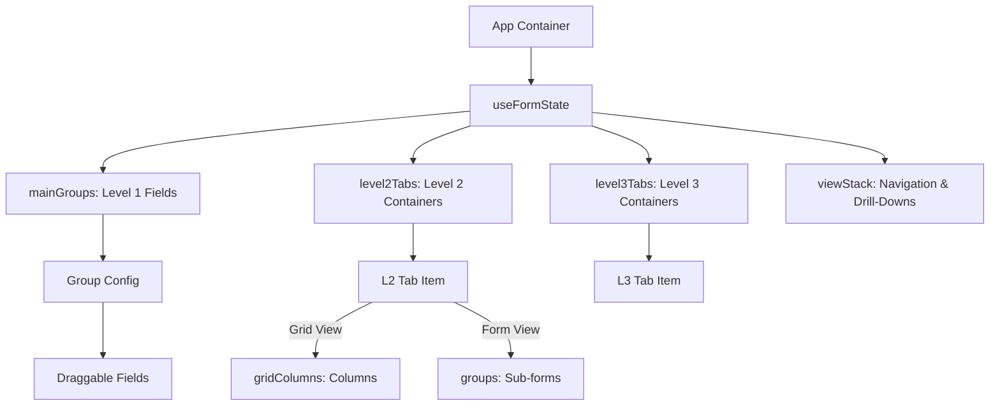

# ERP Form Builder — Modular, Premium RTL-First Drag-&-Drop Designer

[](README.md)
[](README.fa.md)

A state-of-the-art drag-and-drop form designer tailored for complex enterprise ERP environments. Built with native RTL (Right-to-Left) Persian layout support, premium micro-animations (Motion), a sleek glassmorphism aesthetic, and automated E2E test coverage.


---

## 📖 Table of Contents

- [Introduction & Case Study Context](#-introduction--case-study-context)
- [Technical Pillars & Key Features](#-technical-pillars--key-features)
- [Architecture & State Flow](#-architecture--state-flow)
- [Development Chronology & Process (Step-by-Step)](#-development-chronology--process-step-by-step)
- [Results & Impact](#-results--impact)
- [Automated Validation & Business Constraints](#-automated-validation--business-constraints)
- [LLM Token Optimization System](#-llm-token-optimization-system)
- [Running & Testing Locally](#-running--testing-locally)

---

## 💼 Introduction & Case Study Context

Forms in enterprise ERP systems are not just simple input collections—they are gateways for complex business logic, database relation mapping, dynamic calculations, and multi-level data hierarchy. Traditional form designers are almost exclusively LTR-first, resulting in broken alignment, visual bugs, and awkward user experiences when adapted to RTL languages like Persian.

This project serves as a **Case Study** for engineering a modern, modular form designer designed from the ground up to solve these constraints. It features:
- Deep layout nesting (mixing panels and tables across three logical levels).
- Direct binding of form fields to real database entity schemas.
- High-fidelity visual styling with active theme switching and premium UX micro-animations.

---

## 🌟 Technical Pillars & Key Features

### 1. Native RTL-First Layout
- Set to RTL layout (`dir="rtl"`) at the root.
- Uses Tailwind CSS v4 logical spacing properties (e.g. `ms-*` for margin-start, `pe-*` for padding-end, and `start-*`/`end-*` for positioning) to ensure layout symmetry.
- Renders premium typography using the **Vazirmatn** font family, ensuring high readability for Persian enterprise interfaces.

### 2. Multi-Level Form Hierarchy
- **Level 1 (Main Panel)**: Handles primary document metadata and base fields grouped into sections.
- **Level 2 (Tab Panels)**: Renders bottom-level tabs (such as the "Items" tab), locked as a high-density Grid Table.
- **Level 3 (Detail Drill-down)**: Clicking on a grid row in Level 2 drills down into detail views or child tabs for that specific line item.

### 3. Database Schema Auto-Binding
- Connects groups or grids to mocked ERP database entity tables (e.g. `sales_process`, `sales_stages`, `stage_info`).
- Automatically populates draggable fields or grid columns with corresponding database attributes.
- Features dynamic loading animations and status badges (e.g., "Connected to Sales Stages") to give instant feedback.

### 4. Portal-Rendered Popover Editors
- Properties and formula configurations render using React Portals at the top-level of the DOM to prevent parent overflow cropping.
- Dynamically calculates the clicked element's position to vertically align the editor popover next to it.
- Includes a pointing arrow for precise visual anchoring.

### 5. Smart Summary Aggregation Rows
- Allows configuring custom calculation rows (e.g. Total Sum, Average) in the footer of L2/L3 Grid Tables.
- Renders an interactive multi-select dropdown to choose target columns for aggregation.
- Features a drag-and-drop handle to reorder summary rows within the portal-rendered editing popover.

### 6. Circular Theme-Switching Transition
- Seamlessly toggles between Light and Dark modes.
- Utilizes the modern browser View Transitions API to trigger a smooth, expanding circular mask transition centered on the theme switch button.

---

## 📊 Architecture & State Flow

The entire application relies on a single source of truth managed inside the `useFormState` custom hook, preventing desynchronization between canvas panels, sidebars, and settings editors.



### Directory Map
- `src/App.tsx`: App shell coordinating headers, canvas layouts, and property sidebars.
- `src/hooks/useFormState.ts`: State reducer hook housing default mocks and field sync handlers.
- `src/components/canvas/`: Includes the main canvas wrapper (`MainPanel.tsx`) and the multi-level tab controller (`DetailPanel.tsx`).
- `src/components/layout/`: Includes Toolbar (`Header.tsx`), Component Toolbox (`Sidebar.tsx`), and the right-side attribute panel (`SettingsPanel.tsx`).
- `src/components/settings/`: Houses dedicated property forms (`FieldSettings.tsx`, `TextFieldSettings.tsx`, `TabPanelSettings.tsx`).
- `src/components/shared/`: Atomic controls (Toggles, Custom Dropdowns, and Formula editors).

---

## 🛠️ Development Chronology & Process (Step-by-Step)

The project was built and refined incrementally across the following development phases:

### Phase 1: RTL Design System & Tailwind v4 Setups
Established styling guidelines using Tailwind CSS v4 variables inside `index.css`. Tailored typography with the Vazirmatn font and mapped out RTL logical spacing classes.

### Phase 2: Centralized React State Hook & Navigation
Engineered `useFormState.ts` to manage all groups, fields, and tabs in a clean hierarchy. Structured the `viewStack` navigation array to track breadcrumbs, enabling seamless drill-down transitions and breadcrumb navigation.

### Phase 3: Portals, Popovers & Grid Summaries
Created portal-based popovers that align next to clicked fields. Built the table footer configuration engine, incorporating the multi-select column dropdown and drag-and-drop reordering of aggregation rows.

### Phase 4: Business Logic Locks & Refinements
Solidified the design by adding strict validation checks:
- Locked the primary group (`g_base`) to prevent deletion.
- Integrated the Main Panel's title change dynamically with the active breadcrumb in the `viewStack`.
- Removed native inputs' `placeholder` attributes entirely and replaced them with helper text paragraphs rendered directly under the inputs.
- Locked Level 2 tabs to a Grid Table view, hiding the view-type toggle switcher to match the specific ERP layout constraint.

### Phase 5: Automated Testing & Validation Rigor
Engineered a strict verification script (`validate_rules.mjs`) to test the codebase against color conventions, schema locks, and state synchronization. Added **Playwright** end-to-end integration tests (`smoke.spec.ts` and `form-builder.spec.ts`) to simulate user flows, drag-and-drop actions, language toggling, and summary calculations.

---

## 🏆 Results & Impact

> *"Paper wireframes and static Figma frames describe intent. A live, interactive prototype proves it."*

This prototype was built with a clear north star: to turn abstract design concepts into a tangible, hands-on experience that anyone — engineer, product manager, or executive — could click through in real time. The results exceeded expectations across the board.

### 🎯 Communicating Ideas Interactively to Stakeholders

Presenting a complex multi-level ERP form designer to non-technical stakeholders is notoriously difficult. Static mockups and slide decks fall flat — stakeholders can't feel the drag-and-drop, can't see how the hierarchy collapses, can't experience the RTL layout shift.

With this prototype, demo sessions became **conversations instead of presentations**. Stakeholders could:
- Drag a field onto the canvas themselves and feel the snap-to-grid behavior.
- Open a Tab Panel, add a Summary Row, and configure an aggregation formula live.
- Switch between Persian and English and immediately see the entire layout mirror correctly.

The reaction was immediate and clear: **stakeholders understood the design intent on first contact**, without needing lengthy explanations or annotated screenshots.

### 🔍 Surfacing Detail Interactions & Edge Cases in Practice

One of the most valuable outcomes was **discovering what Figma could never show**. During live prototype sessions, several non-obvious interaction details and edge cases emerged naturally:

- **Resize handle directionality**: The column-span drag handle behaved correctly in RTL (Persian) but was mirrored for LTR (English) — caught during a live demo and fixed immediately.
- **Popover overflow clipping**: The portal-rendered popovers revealed how static overflow containers in real browsers clip absolute-positioned elements differently than Figma's artboards.
- **Summary row reordering**: Drag-and-drop reordering of aggregation rows exposed a state-sync issue between the editing popover and the footer render — an edge case impossible to anticipate in a static design.
- **Placeholder vs. helper text UX**: Live interaction revealed that native `placeholder` text disappeared the moment a user started typing, making in-context guidance invisible. The fix (replacing placeholders with persistent helper text below inputs) came directly from observing real usage.

These weren't bugs caught in QA — they were **design decisions discovered through doing**, proving the irreplaceable value of interactive prototyping over static deliverables.

### 💡 Rapid Idea Prototyping & Selecting the Best Approach

Several key features were explored through multiple competing approaches before the best solution was chosen:

| Feature | Approaches Tried | Chosen Solution |
|---|---|---|
| Summary row configuration | Inline editor / Side panel / Portal popover | Portal popover (no layout disruption) |
| Entity binding indicator | Color-coded badge / Icon tooltip / Inline text | Teal status badge (highest clarity at a glance) |
| Theme switching animation | Fade / Slide / Circular mask expand | View Transitions API circular expand (most premium feel) |
| RTL resize handle | Always-left / Direction-aware | Direction-aware (`right` in LTR, `left` in RTL) |

Having a live prototype meant that **each approach could be built in hours and tested against real feel**, not theorized on a whiteboard. The winning option was always chosen based on direct interaction, not opinion.

### ✅ Stakeholder & Team Reception

| Audience | Outcome |
|---|---|
| **Design Team Manager** | Signed off on the interaction model after the first live demo session. The working prototype removed ambiguity from design reviews entirely. |
| **Business Stakeholders** | Strongly preferred the interactive prototype over previous Figma presentations — *"Now I actually understand what we're building."* |
| **Engineering Team** | Used the prototype as a living spec, referencing real component behavior instead of interpreting annotated wireframes. |

### 📌 The Core Lesson

Paper sketches define *what*. Figma prototypes simulate *how it looks*. A working interactive prototype answers the only question that truly matters in enterprise UX: **how does it actually behave under real conditions?**

This project demonstrated that investing in a high-fidelity, interactive prototype pays dividends far beyond aesthetics — it accelerates alignment, eliminates guesswork, and delivers a shared understanding that no static deliverable can match.

---

## 🔒 Automated Validation & Business Constraints

To ensure regression-free development, running the local validator checks the codebase against key requirements:
1. Blocks invalid Tailwind CSS color shades (like `slate-850` or `slate-450`).
2. Confirms base group (`g_base`) deletion blocks are active.
3. Validates that placeholder attributes are replaced with helper texts in the form canvas.
4. Verifies footer editor states and L2 grid view locks.

To run the validator manually:
```bash
npm run validate
```

---

## 🛠️ LLM Token Optimization System

This project implements three cognitive maps designed specifically for AI co-pilots. Referencing these files instead of scanning raw source code saves **over 90% of token consumption** per session:

- 🗺️ **[AGENT.md](AGENT.md)**: AI development guidelines, directory maps, and modification recipes.
- 🎨 **[DESIGN.md](DESIGN.md)**: Color palettes, spacing rules, and CSS component Tailwind class mappings.
- 📊 **[STRUCTURE.md](STRUCTURE.md)**: Strict TypeScript interfaces, mock schema maps, and Mermaid architecture diagrams.

---

## 🚀 Running & Testing Locally

### Prerequisites
- macOS, Windows, or Linux
- Node.js (version 18+)

### Commands

1. Install project dependencies:
```bash
npm install
```

2. Run the local development server (Vite + Express):
```bash
npm run dev
```
Access the application on [http://localhost:4000](http://localhost:4000).

3. Run Playwright E2E tests:
```bash
# Headless test runner
npm run test:e2e

# Interactive test UI
npm run test:e2e:ui

# Playwright Codegen generator
npm run test:e2e:codegen
```
