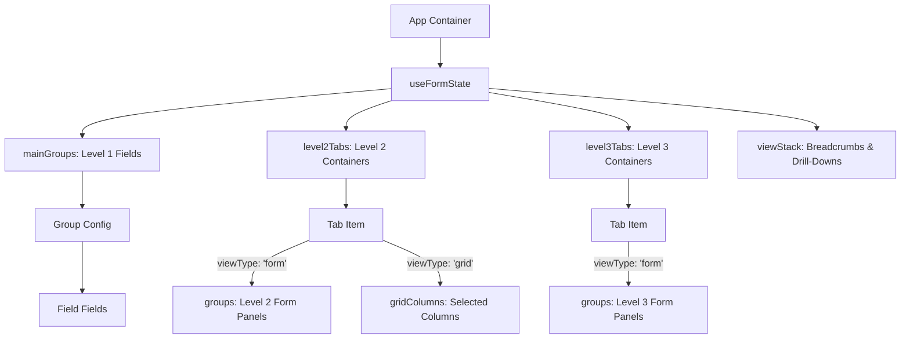

# STRUCTURE.md — Data Models & State Architecture

This document defines the schema designs, mock entities, and UI state routing of the ERP Form Builder. It serves as a visual and structure reference for the LLM.

---

## 1. Data Schema Hierarchy (Mermaid Diagram)



---

## 2. State Shape Definitions

### A. Field Node
Represents a drag-and-drop form field component.
```typescript
interface Field {
  id: string;                    // Unique element ID (e.g., 'field_1720000000000')
  type: string;                  // Component type ('comp-text', 'comp-number', 'comp-check', 'comp-list')
  label: string;                 // UI Label in Persian
  name: string;                  // System binding name
  boundSystemField: string;      // Key of the entity field it binds to (e.g., 'c_1')
  required: boolean;             // Validation constraint
  placeholder?: string;          // Placeholder text (text field only)
  minLength?: number;            // Min validation length
  maxLength?: number;            // Max validation length
  defaultValue?: string;         // Default input value
  multiline?: boolean;           // Renders text area if true
  formula?: FormulaConfig;       // Formula expression configurations
  aggType?: AggType;             // Summary aggregation option
}
```

### B. Group Container
Represents a sectional layout block inside a form canvas.
```typescript
interface Group {
  id: string;                    // Group ID (e.g., 'g_base', 'l2g_base_1')
  name: string;                  // Section title (Persian)
  columns: number;               // Column count layout (usually 2)
  fields: Field[];               // Ordered list of children fields
}
```

### C. Tab Panel Config
Represents an L2 or L3 tab pane. Can show a table (Grid) or detail components (Form).
```typescript
interface TabPanel {
  id: string;                    // Tab identifier (e.g., 'l2_tab_1')
  title: string;                 // Tab text label (Persian)
  boundEntity: string;           // Bound schema name (e.g., 'sales_stages')
  viewType: 'grid' | 'form';     // Rendering format
  gridColumns: string[];         // Active column IDs shown in grid
  groups: Group[];               // Child field groups if viewType is 'form'
  gridSettings: {
    showAdd: boolean;            // Displays Add New button
    showSearch: boolean;         // Displays search inputs
    showCheckbox: boolean;       // Displays row checkbox selectors
  };
}
```

### D. View Stack (Navigation Routing)
Maintains the drill-down navigation breadcrumbs.
```typescript
type ViewState = 
  | { id: 'root'; type: 'main'; title: string }
  | { id: number; type: 'detail'; title: string; probability?: string };

// Active View is always: viewStack[viewStack.length - 1]
```

---

## 3. Mock Entity Dictionary Reference

The application contains hardcoded mock data mapping ERP business objects. Below are their keys and fields:

| Entity Key | Entity Name (Persian) | Available Fields |
| :--- | :--- | :--- |
| `sales_process` | روند فروش | `f_main_1` (Text: عنوان روند) |
| `sales_stages` | مراحل فروش | `c_1` (Text: نام مراحل)<br>`c_2` (Number: احتمال موفقیت)<br>`c_3` (Text: توضیحات) |
| `stage_info` | اطلاعات مرحله | `s_1` (Text: توضیحات تکمیلی) |
| `key_info` | اطلاعات کلیدی | `k_1` (Text: نام فیلد)<br>`k_2` (Checkbox: اجباری) |
